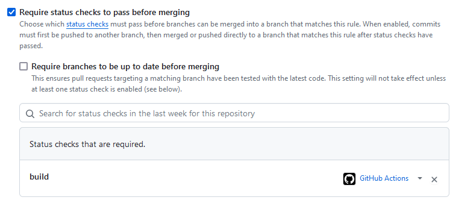

# Blockchain Busters - Eksamen

## Oppgave 1 - B
**1. Først går jeg i repo-innstillinger > "Branches" > "Add branch protection rule"**

**2. Så definerer jeg branchen som skal beskyttes og krever pull request (med 2 godkjenninger)**

**3. Så aktiverer jeg status checks, her "build" fra docker.yml**

Her kunne jeg også lagt inn tester og lignende fra workflows

