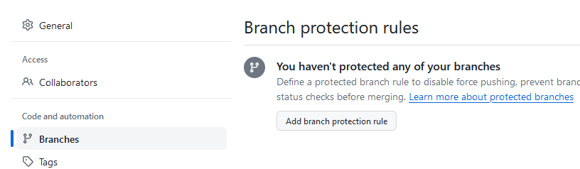
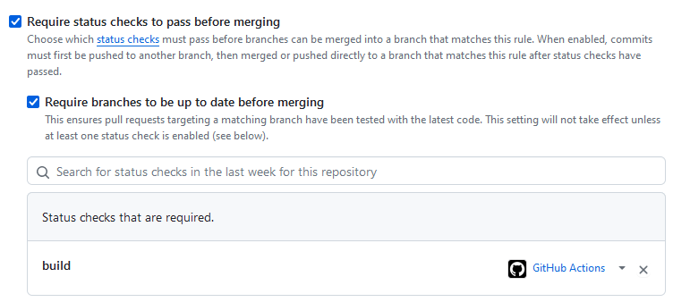
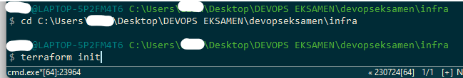
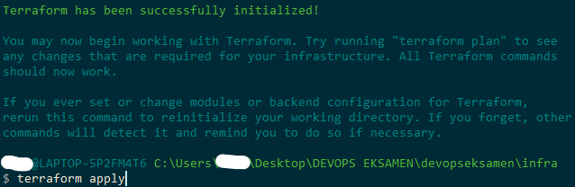
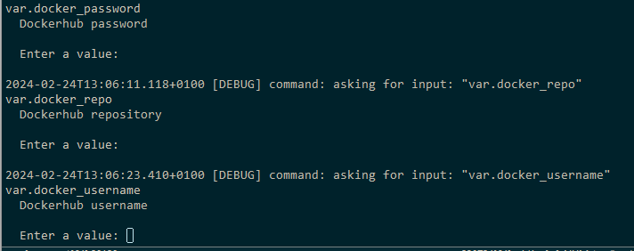
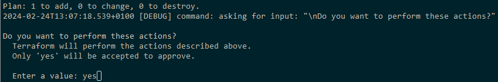
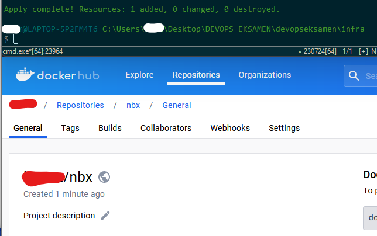
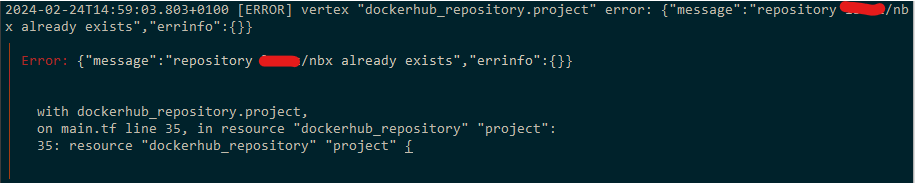
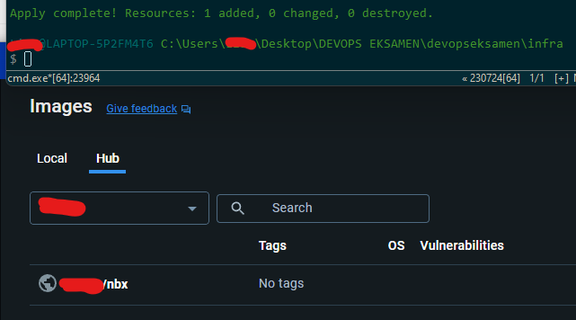

# HUSK Å GJØRE REPO PUBLIC FØR LEVERING

# Blockchain Busters - Eksamen

## Oppgave 1 - B
**1. Først går jeg i repo-innstillinger > "Branches" > "Add branch protection rule"**

**2. Så definerer jeg branchen som skal beskyttes og krever pull request (med 2 godkjenninger)**

**3. Så aktiverer jeg status checks, her "build" fra docker.yml**

Her kan du legge inn alt du måtte trenge fra workflows

## Oppgave 1 - C

Fordelen med å ha minst to som godkjenner endringer mot main branch er mer enn ett sikkerhetsledd. Da er sjansen mye lavere for menneskelige feil som å overse noe, godkjenne med et uhell og at noen er utslitte og ikke tenker helt klart. Det er noe jeg selv har erfart i gruppearbeid. Det gir også en økt trygghetsfølelse i situasjoner der kanskje noen i en gruppe ikke vet helt hva de driver med til tider.

En ulempe med at to personer må godkjenne er at arbeidsflyten vil bli tregere og det kan føles som "micromanagament" til tider. Men da må man minne seg på at dette sikkerhetsleddet gjør et prosjekt mye mer effektivt og trygt i lengden.

## Oppgave 2 - B ##

**1. Naviger til infra-directory & skriv "terraform init"**

**2. Når Terraform er ferdig initialisert, skriv "terraform apply"**

**3. Skriv inn passord, reponavn (nbx) og brukernavn for Dockerhub**

**4. Godkjenn med "yes"**

**5. Hvis alt virker, opprettes repoet på din Dockerhub!**

## Oppgave 2 - C

**1. Når jeg kjører "terraform apply" igjen får jeg denne meldingen**

Det er fordi repoet allerede eksisterer på Docker hub. Her er hvordan man kan fikse dette:

**2. På hub.docker.com/repositories kan du slette repoet i innstillinger**

**3. Når repoet er slettet kan du kjøre "terraform apply" og det vil virke denne gangen**

